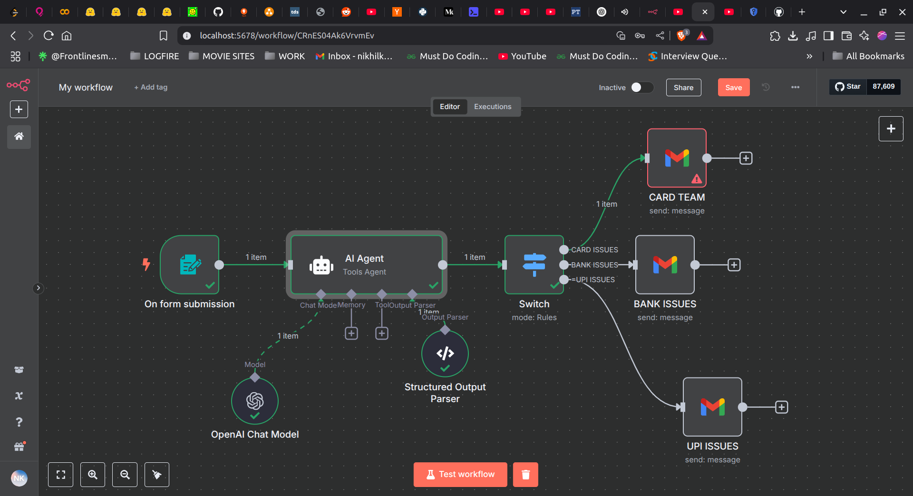
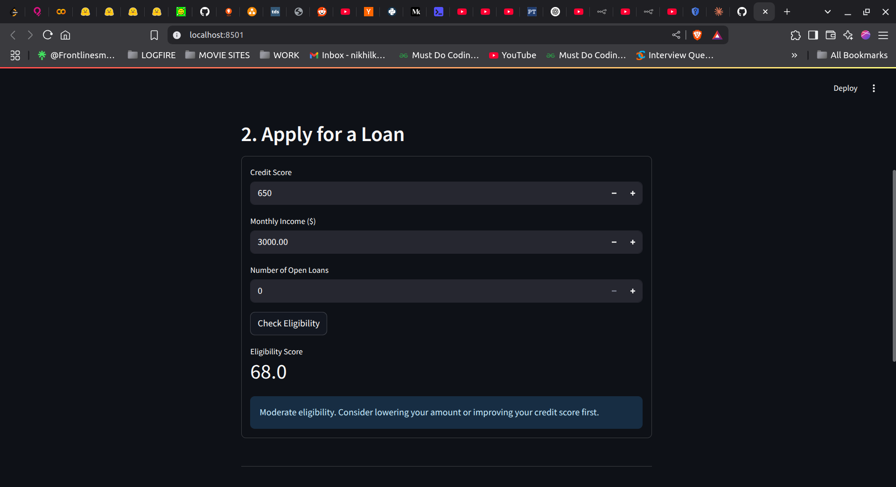

## Task 1 :Overview

Banks receive hundreds of dispute forms daily. This project:

1. **Collects** dispute submissions via a user-facing form.  
2. **Classifies** each dispute (e.g. cards, UPI, net banking).  
3. **Prioritizes** based on VIP status, amount, and fraud risk.  
4. **Routes** to the correct support team with AI-generated next-step recommendations.  

---

## Architecture & Workflow

- **Trigger**: Form submission → workflow engine  
- **AI Agent**: Parses free-text dispute, classifies team & priority, generates an agent note  
- **Switch Node**: Routes to one of:  
  - Card Team  
  - UPI Team  
  - Net Banking Team  
  - ATM Team  
  - Loan Team  
  - Fraud Investigation  
  - General Support  
- **Notifier**: Sends the structured message to the appropriate support mailbox

---

## Workflow Diagram



1. **On form submission**  
2. **AI Agent** (Tools Agent + Chat model)  
3. **Structured Output Parser**  
4. **Switch (Rules)**  
5. **Notification** (Gmail / Slack / internal tool)

---

## AI Agent Prompt

This prompt powers "Zen-Bank Dispute Brain":

```text
You are “Zen-Bank Dispute Brain,” an expert banking-domain triage model.
You will be provided with the customer Query:

    {{ $json["User Query"] }}

**TASK**
1. Read *customer_query*.  
2. Classify the dispute into one of the following team values:
   - card
   - upi
   - net_banking
   - atm
   - loan
   - fraud_investigation
   - general_support

3. Determine priority (high | medium | low) using these rules:
   - HIGH  → VIP customer **or** amount ≥ ₹50,000 **or** potential fraud keywords (“fraud”, “unauthorised”, “scam”).
   - MEDIUM→ amount ₹10,000–49,999 **or** repeat dispute (>2 in six months).
   - LOW   → everything else.

4. Provide **specific next-step advice** (≤40 words) for the support agent.

**OUTPUT (valid JSON)**
```json
{
  "team"           : "<team>",
  "priority"       : "<priority>",
  "agent_note"     : "<short action recommendation>",
  "confidence"     : "<0-1>",
  "chain_of_thought": "<VERY brief reasoning (≤30 words)>"
}```

# AI-Powered Customer Portal MVP

This project implements a rapid MVP for Zeta's self-service customer portal with AI-powered loan eligibility recommendations. The solution is built with a 24-hour development timeline in mind, focusing on practical implementation choices and smart automation.

## Solution Overview

This MVP provides three core functionalities:
1. Account balance checking
2. AI-powered loan eligibility assessment
3. Dispute management system

## Technical Architecture

### Frontend

- **Technology**: Streamlit
- **Features**:
  - Clean, intuitive UI requiring minimal code
  - Three functional sections for each core feature
  - Responsive design with form validation
  - API integration with backend services

### Backend
- **Technology**: FastAPI
- **Features**:
  - RESTful API endpoints for all functionality
  - Pydantic models for data validation
  - Basic AI logic for loan eligibility scoring
  - In-memory data storage (would be replaced with a database in production)

### AI Component
The loan eligibility system uses a straightforward but effective algorithm that:
- Weighs credit score as the primary factor
- Adjusts based on income level
- Applies penalties for existing debt
- Generates human-readable recommendations with specific advice


### Running the Backend
```bash
python backend.py
```

### Running the Frontend
```bash
streamlit run frontend.py
```

The application will be available at http://localhost:8501


### Task 3: Overview

# Scalable Banking API

This project implements a high-performance, scalable banking transaction API designed to process millions of daily transactions while maintaining data consistency, low latency, and fault tolerance.

## System Architecture

### Core Components

1. **FastAPI Application**
   - RESTful API endpoints for banking operations
   - Asynchronous request handling
   - Input validation and error management
   - Rate limiting for security and stability

2. **Database Layer**
   - PostgreSQL with asyncpg driver for non-blocking operations
   - Transaction isolation and row-level locking
   - Optimized query patterns

3. **Data Models**
   - Account management with balance tracking
   - Transaction history and audit trail
   - Multi-currency support

## API Endpoints

### 1. Debit Transaction
**Endpoint:** `POST /transactions/debit`  
**Description:** Deducts funds from an account  
**Request Body:**
```json
{
  "account_id": 123,
  "amount": 100.50
}
```
**Features:**
- Validation to prevent negative amounts
- Insufficient funds protection
- Rate limiting (5 requests per minute)
- Atomic operations with row-level locking

### 2. Credit Transaction
**Endpoint:** `POST /transactions/credit`  
**Description:** Adds funds to an account  
**Request Body:**
```json
{
  "account_id": 123,
  "amount": 100.50
}
```
**Features:**
- Validation to prevent negative amounts
- Atomic operations with database locking
- Full transaction audit trail

### 3. Balance Inquiry
**Endpoint:** `GET /accounts/{account_id}/balance`  
**Description:** Retrieves current account balance and currency  
**Response:**
```json
{
  "account_id": 123,
  "balance": 1500.75,
  "currency": "USD"
}
```

## Technical Implementation

### Database Schema

The system uses two primary tables:

1. **Accounts Table**
```sql
CREATE TABLE accounts (
    id         SERIAL PRIMARY KEY,
    balance    NUMERIC(14, 2) NOT NULL DEFAULT 0,
    currency   VARCHAR(3) NOT NULL DEFAULT 'USD',
    created_at TIMESTAMP WITH TIME ZONE DEFAULT NOW(),
    updated_at TIMESTAMP WITH TIME ZONE DEFAULT NOW()
);
```

2. **Transactions Table**
```sql
CREATE TABLE transactions (
    id         SERIAL PRIMARY KEY,
    account_id INTEGER NOT NULL REFERENCES accounts(id),
    type       VARCHAR(10) NOT NULL, -- 'debit' or 'credit'
    amount     NUMERIC(14, 2) NOT NULL,
    created_at TIMESTAMP WITH TIME ZONE DEFAULT NOW()
);
```

### Ensuring Transaction Consistency

1. **Database Transactions**
   - All operations use SQL transactions with proper isolation levels
   - Automatic rollback on errors ensures atomicity

2. **Row-Level Locking**
   - `SELECT FOR UPDATE` ensures exclusive access during balance updates
   - Prevents race conditions and "lost update" problems

3. **Crash Recovery**
   - PostgreSQL's Write-Ahead Logging (WAL) ensures durability
   - Transaction journaling protects against partial commits

### Performance Optimizations

1. **Asynchronous Processing**
   - Non-blocking I/O with asyncpg and FastAPI
   - Connection pooling for reduced connection overhead

2. **Query Optimization**
   - Minimal database round-trips
   - Indexed fields for common access patterns
   - Optimized SELECT queries with minimal field selection

3. **Caching Strategy**
   - Potential for Redis-based balance caching (implementation ready)
   - TTL-based invalidation on transaction processing

4. **Horizontal Scaling**
   - Stateless API design allows for multiple instances
   - Database connection pooling across instances

## Concurrency Safety

The implementation addresses concurrency challenges through:

1. **Pessimistic Locking**
   - Row-level locks prevent simultaneous updates to the same account
   - Deadlock prevention through consistent lock acquisition order

2. **Transaction Isolation**
   - Serializable isolation level for critical operations
   - Read Committed for balance inquiries

3. **Rate Limiting**
   - Prevents API abuse
   - Stabilizes system under high load

## Error Handling

The API provides detailed error responses:

1. **HTTP Status Codes**
   - 404: Account not found
   - 400: Invalid input or insufficient funds
   - 500: System errors with detailed logging

2. **Error Messages**
   - User-friendly error descriptions
   - Internal error logging for debugging

